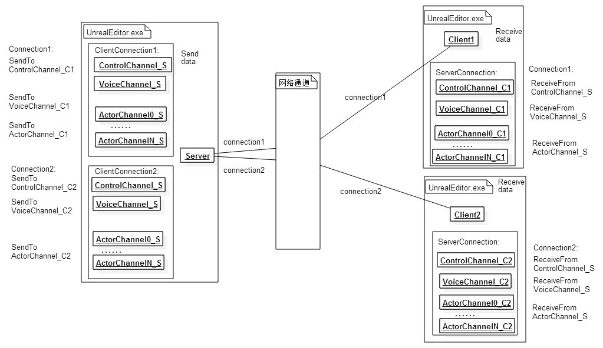

# NET

----

## UE4网络基本通信架构


这是Jerish大佬画的图，基本解释了Connection和Channel的概念，Connection相当于客户端与服务器实际的会话连接，Channel相当于同步具体Actor、Controller信息的通道。

了解了ue4网络同步的基本架构，大致可以自顶向下分为三大部分。

1. 哪些actor需要同步：actor与连接的相关性
2. 如何同步actor的数据：属性同步与RPC
3. 数据同步的底层实现：Bunch的可靠传输过程

## Bunch可靠传输过程简述

Packets 是在Connection上发送的数据块。
Bunches 是在Channel上发送的数据块。
一个 Packet 可以不包含 Bunch、单个 Bunch 或者多个 Bunch。当一个 Bunch 太大时，在传输之前，我们会把它切成许多小 Bunch，这些 Bunch 将被标记为 PartialInitial, Partial 或 PartialFinal。利用这些信息，我们可以在接收端重新组装 Bunch。
Bunch 序列号是每个通道的，每发送一个可靠 Bunch 就递增它的 Bunch 序列号。当Bunch需要重传时，将重新发送具有相同 Bunch 序列号的 Bunch，而Packet是每次都重新组装的，不会缓存Packet重发。
这也就说明 __可靠性是在Bunch这一层面上的__ 。
接下来介绍一下UE4底层网络包如何实现可靠性。

### 发端

1.`UChannel::SendBunch`:首先channel和可靠性相同，并且允许合并的小bunch可以合并，节省bunch头部的消耗。然后需要将过大的的Bunch切分成partial bunch，并且把处理过的bunch放到OutgoingBunches中。经过合并切分处理的bunch，暂且称之为raw bunch，接下来可靠也是建立在raw bunch这一层面上的。
接下来遍历OutgoingBunches，同步partial信息用于收端还原完整bunch，通过PrepBunch给raw bunch分配ChSequence，相当于是raw bunch递增的序列号。若可靠，需要塞到OutRec的末尾，用于在丢包的时候重新发送。
通过SendRawBunch将所有的raw bunch添加头部信息再发出去，并且记录PacketId的范围并返回（原始bunch可能会拆分到不同的packet）。

2.`UNetConnection::SendRawBunch`：为raw bunch建立头部，包括Reliable、Partial等信息，把头部和bunch的数据都push到SendBuffer（WriteBitsToSendBufferInternal），记录并返回PacketId。
FlushNet的时候就会把SendBuffer中的数据通过LowLevelSend发出去。
e.g.  pkt1 |A|B1|   pkt2|B2|C|   pkt3|D|

### 收端

3.`UNetConnection::ReceivedRawPacket`：此时收端通过StatelessConnectHandlerComponent::Incoming处理握手、校验、加密、压缩（并没有看懂），解析并构造FBitReader，在ReceivedPacket中真正处理Packet。

4.`UNetConnection::ReceivedPacket`:首先，通过ReadHeader解析Packet中的包头，通过包头的序列号减去上次收包的序列号得出packet序列号增量，判断有没有丢包、是否由于底层的原因收到了历史的包(丢弃即可)。
如果发现有丢失的packet（1<序列号增量<=MaxMissingPackets），虽然bunch有缓存等待丢失bunch重发的机制，但是可能是因为udp乱序比较频繁，这里会将丢失packet存到PacketOrderCache，之后会通过FlushPacketOrderCache检查并将收到的packet按顺序通过ReceivedPacket处理。假如没有丢包，直接进入解析packet的流程(5)。（PacketNotify分析收到AckNak信息的过程之后在发端介绍(8)）
接下来会解析分发packet中所有的raw bunch。确定当前raw bunch的其起始位置，解析还原出PacketId,bReliable,ChIndex,bPartial等信息。根据ChIndex找到对应的channel(找不到可能会创建Chanel)，调用ReceivedRawBunch。

5.`UChannel::ReceivedRawBunch`如果raw bunch可靠，并且不是下一个待接受的raw bunch序列号，则需要缓存到InRec等待前面的raw bunch。如果不可靠，或者确实是按顺序收到的，则直接进入ReceivedNextBunch进一步处理处理。

6.`UChannel::ReceivedNextBunch`：处理按顺序进Channel的raw bunch， __这一步进来的都是顺序正确的raw bunch__ 。如果是可靠的Bunch，则更新该Channel可靠bunch序列号。如果来包是PartialBunch的第一个包，就复制构造到InPartialBunch，之后来的部分都合入InPartialBunch(AppendDataFromChecked)。
为了合成正确的完整Bunch，这里还需要确保partial bunch的顺序。如果是可靠的partial bunch，那么它的序列号应该是InPartialBunch+1，如果是不可靠的partial bunch，由于不可靠bunch使用的序列号就是packet的序列号，那么他的序列号应该与InPartialBunch相同，这一步就可以保证合成整bunch的正确性。
如果顺利接收merge入了最后一个PartialBunch，此时已经有了完成的bunch，可以执行ReceivedSequencedBunch&ReceivedBunch进行具体的处理。否则将会丢弃这个raw bunch，如果是可靠的bunch，将会通过设置bOutSkipAck为true，标记包含这个raw bunch的packet为nak，之后发端将重新发送这个packet中的所有可靠raw bunch。
(接下来就是`ReceivedBunch`&`ProcessBunch`的部分)

7.回到UNetConnection::ReceivedPacket，这里会根据channel设置的bSkipAck将ack/nak信息通过FNetPacketNotify::AckSeq塞入InSeqHistory。

``` c++
UNetConnection::ReceivedPacket(...)
{
    ... ...
    bool bLocalSkipAck = false;
    Channel->ReceivedRawBunch( Bunch, bLocalSkipAck ); 
    if ( bLocalSkipAck )
        bSkipAck = true;
    ... ...
    if ( bSkipAck )
        PacketNotify.NakSeq( InPacketId );
    else
        PacketNotify.AckSeq( InPacketId );
    if (HasDirtyAcks >= FNetPacketNotify::MaxSequenceHistoryLength)
        //把ack信息flush给对方
        FlushNet();
}
```

### 发端处理ack/nak

8.`FNetPacketNotify::ProcessReceivedAcks`：ack信息回到发端

``` c++
// UNetConnection::ReceivedPacket
auto HandlePacketNotification = [&Header, &ChannelsToClose, this](FNetPacketNotify::SequenceNumberT AckedSequence, bool bDelivered)
{
            ++LastNotifiedPacketId;
            ++OutTotalNotifiedPackets;
            Driver->IncreaseOutTotalNotifiedPackets();
            if (FNetPacketNotify::SequenceNumberT(LastNotifiedPacketId) != AckedSequence)
                return;
            if (bDelivered)
                ReceivedAck(LastNotifiedPacketId, ChannelsToClose);
            else
                ReceivedNak(LastNotifiedPacketId);
};
```

ConsumeChannelRecordsForPacket找到对应Channel,ReceivedAck

```  c++
    auto AckChannelFunc = [this, &OutChannelsToClose](int32 AckedPacketId, uint32 ChannelIndex)
    {
        UChannel* const Channel = Channels[ChannelIndex];
        if (Channel)
        {
           ... ...     
            for (FOutBunch* OutBunch = Channel->OutRec; OutBunch; OutBunch = OutBunch->Next)
            {
                ... ...
                if (OutBunch->PacketId == AckedPacketId)
                    OutBunch->ReceivedAck = 1;
            }
            Channel->ReceivedAck(AckedPacketId);
            EChannelCloseReason CloseReason;
            if (Channel->ReceivedAcks(CloseReason))
            {
                const FChannelCloseInfo Info = {ChannelIndex, CloseReason};
                OutChannelsToClose.Emplace(Info);
            }   
        }
    };
```

ReceivedNak，遍历outrec中所有的outbunch，如果PacketId相同并且没收到ack，发出去。

```  c++
void UChannel::ReceivedNak( int32 NakPacketId )
{
    for( FOutBunch* Out=OutRec; Out; Out=Out->Next )
    {
        // Retransmit reliable bunches in the lost packet.
        if( Out->PacketId==NakPacketId && !Out->ReceivedAck )
        {
            ... ...
            Connection->SendRawBunch( *Out, 0 );
        }
    }
}
```

[UE4 UDP是如何进行可靠传输的_Jerish的博客-CSDN博客](https://blog.csdn.net/u012999985/article/details/117236770)
FNetPacketNotify::ProcessReceivedAcks
如果收到nak则会将outrec中packetid相同的raw bunch全部重新发送一遍。


### 发数据流程


### 收数据流程


以上是ue4底层实现可靠udp的内容，接下来介绍网络模块结合UE4游戏框架的部分。

## Actor同步流程

概念介绍：
img

__FObjectReplicator__ 属性同步的执行器，每个Actorchannel对应一个FObjectReplicator，每一个FObjectReplicator对应一个对象实例。设置ActorChannel通道的时候会创建出来。

__FRepState__ 针对每个连接同步的历史数据，记录同步前用于比较的Object对象信息，存在于FObjectReplicator里面。

__FRepLayOut__ 同步的属性布局表，记录所有当前类需要同步的属性，每个类或者RPC函数有一个。

__FRepChangedPropertyTracker__ 属性变化轨迹记录，一般在同步Actor前创建，Actor销毁的时候删掉。

__FReplicationChangelistMgr__ 存放当前的Object对象，使用环形缓冲区，保存属性的变化历史记录。位置不够时合并最旧的记录，主要用于nak时resend之前记录的属性。

下面是NetDriver每帧获取需要同步的Actor，并判断相关性，给每个client connection同步过去的过程。

```  c++
//UNetDriver::TickFlush()调用
int32 UNetDriver::ServerReplicateActors(float DeltaSeconds)
{
    //1.遍历NetworkObjectList，获取需要参加网络同步的Actor，检查是否达到下次更新时间ActorInfo->NextUpdateTime
    ServerReplicateActors_BuildConsiderList( GetNetworkObjectList(), ConsiderList, ServerTickTime, true );
    //遍历所有connection
    for ( int32 i=0; i < ClientConnections.Num(); i++ )
    {
        //获取该conn所有的viewer（包含char&controller）
        TArray& ConnectionViewers = WorldSettings->ReplicationViewers;
        ConnectionViewers.Reset();
        new( ConnectionViewers )FNetViewer( Connection, DeltaSeconds );

        //2.给所有的considered actors判断relevant并排序
        //调用Actor::IsNetRelevantFor判断相关（可重写，比如之同步同队playerstate）
        const int32 FinalSortedCount = ServerReplicateActors_PrioritizeActors( Connection, ConnectionViewers, ConsiderList, bCPUSaturated, PriorityList, PriorityActors );

        //3.真正同步，调用到ReplicateActor
        const int32 LastProcessedActor = ServerReplicateActors_ProcessPrioritizedActors( Connection, ConnectionViewers, PriorityActors, FinalSortedCount, Updated );
    }
}
```

2.优先级排序：

九宫格优化，这一步的ConsiderList是该conn同步范围内的actor，通过接口GetPerConnectionCachedConsiderList获取。
该list通过UpdateRegionNetworkObjectLists接口在conn内部tick更新。
首先通过UpdateRegions，通过位置和同步范围，算出进入和退出的区域。
对于所有进入的区域，通过GetRegionNetworkObjectList获取该区域内的所有需要同步的actor，加入到RegionNetworkObjects并设置同步时间等。对于离开的区域，则从RegionNetworkObjects中remove掉，并且关闭对应channel。
以上方法需要维护每个region中的actors，因此actor位置变动的时候需要更新。

3.真正同步actor，创建channel，同步actor
通过IsNetRelevantFor判断actor和conn的相关性。
如果没有channel，创建并SetChannelActor。

3.1. 介绍一下ActorChannel的初始化流程。终点就是初始化RepLayout，作为类属性比较的参照。然后初始化RepState和RepChangedPropertyTracker，用于之后的属性比较。

``` c++
void UActorChannel::SetChannelActor( AActor* InActor )
{
    ... ...
    Connection->ActorChannels.Add( Actor, this );
    //初始化Replicator（调用InitWithObject），添加到ReplicationMap
    ActorReplicator = &FindOrCreateReplicator( Actor ).Get();
}

void FObjectReplicator::InitWithObject( UObject* InObject, UNetConnection * InConnection)
{
    //设置同步对象，之后就直接用这个对象内的数据来比较
    SetObject( InObject );
    ... ...        
    //使用类构造RepLayout（FRepLayout::InitFromObjectClass），作为属性比较的参照
    RepLayout = Connection->Driver->GetObjectClassRepLayout( ObjectClass );
    //复制用于作为旧的状态来比较
    uint8* Source = bUseDefaultState ? (uint8*)GetObject()->GetArchetype() : (uint8*)InObject;
    //初始化RepState和RepChangedPropertyTracker
    InitRecentProperties( Source );
    RepLayout->GetLifetimeCustomDeltaProperties( LifetimeCustomDeltaProperties, LifetimeCustomDeltaPropertyConditions );
}

//初始化RepLayout，作为类属性比较的参照
void FRepLayout::InitFromObjectClass( UClass * InObjectClass )
{
    for ( int32 i = 0; i < InObjectClass->ClassReps.Num(); i++ )
    {
        ... ...
        Parents[ParentHandle].CmdStart = Cmds.Num();
        //实际的属性初始化函数
        RelativeHandle = InitFromProperty_r( Property, Property->ElementSize * ArrayIdx, RelativeHandle, ParentHandle, 0, ArrayIdx );
        Parents[ParentHandle].CmdEnd = Cmds.Num();
    }

    //初始化属性复制条件
    for ( int32 i = 0; i < LifetimeProps.Num(); i++ )
    {
        Parents[LifetimeProps[i].RepIndex].Condition = LifetimeProps[i].Condition;
        Parents[LifetimeProps[i].RepIndex].RepNotifyCondition = LifetimeProps[i].RepNotifyCondition;
    }
}

//初始化旧状态内存的数据，创建RepChangedPropertyTracker和RepState
void FObjectReplicator::InitRecentProperties( uint8* Source )
{
    //1.创建属性变化跟踪器，InitChangedTracker
    TSharedPtr<FRepChangedPropertyTracker> RepChangedPropertyTracker = Connection->Driver->FindOrCreateRepChangedPropertyTracker( GetObject() );
    //2.通过ConstructProperties和InitProperties，遍历property构造初始化StaticBuffer
    RepLayout->InitRepState( RepState, InObjectClass, Source, RepChangedPropertyTracker );
    RepState->RepLayout = RepLayout;
}
```

3.2. UActorChannel::ReplicateActor
有了channel了，接下来真正同步一个Actor

```  c++
bool UActorChannel::ReplicateActor()
{
    //1.ds开启channel时，处理初始化同步
    if( OpenPacketId.First != INDEX_NONE && !Connection->bResendAllDataSinceOpen )
    {
        if( !SpawnAcked && OpenAcked )
        {
            SpawnAcked = 1;
            //收到了初始化的ack，强更所有subobject的不可靠属性
            for (auto RepComp = ReplicationMap.CreateIterator(); RepComp; ++RepComp)
                RepComp.Value()->ForceRefreshUnreliableProperties();
        }
    }
    else
    {
        RepFlags.bNetInitial = true;
        Bunch.bClose = Actor->bNetTemporary;
        Bunch.bReliable = true; // Net temporary sends need to be reliable as well to force them to retry
    }

    if (RepFlags.bNetInitial && OpenedLocally)
    {
        Connection->PackageMap->SerializeNewActor(Bunch, this, Actor);
        WroteSomethingImportant = true;
        Actor->OnSerializeNewActor(Bunch);
    }

    //2.同步actor以及component的属性和rpc
    WroteSomethingImportant |= ActorReplicator->ReplicateProperties(Bunch, RepFlags);
    WroteSomethingImportant |= Actor->ReplicateSubobjects(this, &Bunch, &RepFlags);
    //。。。这里还会处理被删除的Component

    //3.发送Bunch
    if (WroteSomethingImportant)
    {
        FPacketIdRange PacketRange = SendBunch( &Bunch, 1 );
    }
}

//2：同步actor的属性和rpc
bool FObjectReplicator::ReplicateProperties( FOutBunch & Bunch, FReplicationFlags RepFlags )
{
    //通过PackageMap构造序列化名字和UObject*的BitWriter
    FNetBitWriter Writer( Bunch.PackageMap, 8192 );
    //2.1.这里进行属性比较（RepLayout->CompareProperties），接下来介绍属性同步的时候细说
    ChangelistMgr->Update( Object, Connection->Driver->ReplicationFrame, RepState->LastCompareIndex, RepFlags, OwningChannel->bForceCompareProperties );
    //同步属性
    const bool bHasRepLayout = RepLayout->ReplicateProperties( RepState, ChangelistMgr->GetRepChangelistState(), ( uint8* )Object, ObjectClass, OwningChannel, Writer, RepFlags );
    //自定义结构同步fastarray，lua值复制
    ReplicateCustomDeltaProperties( Writer, RepFlags );
    //。。。resend这个connection发送过的所有信息，相当于同步与到最新的状态，可以用于回放同步到一个当前的状态
    //不可靠rpc进队
    if ( RemoteFunctions != NULL && RemoteFunctions->GetNumBits() > 0 )
    {
        Writer.SerializeBits( RemoteFunctions->GetData(), RemoteFunctions->GetNumBits() );
        RemoteFunctions->Reset();
        RemoteFuncInfo.Empty();
    }
    //把局部Writer写的东西塞到OutBunch，外部的channel一起通过SendBunch发送
    if ( WroteImportantData )
        OwningChannel->WriteContentBlockPayload( Object, Bunch, bHasRepLayout, Writer );
}
```

## 属性同步

属性同步相关概念：

```  c++
//一条同步记录
class FRepChangedHistory
{
    FPacketIdRange OutPacketIdRange;//发出去的packet id范围
    TArray<uint16> Changed;//变化的属性index
    bool Resend;//是否需要重发，收到nak，判断packet id，设置重发
}

//记录同步历史的环形缓冲，用于重发属性等等
class FRepChangelistState
{
    FRepChangedHistory ChangeHistory[MAX_CHANGE_HISTORY];//同步记录的环形缓冲区，MAX_CHANGE_HISTORY=64
    int32 HistoryStart, HistoryEnd;
    TUniquePtr<struct FCustomDeltaChangelistState> CustomDeltaChangelistState;//自定义同步属性
    FRepStateStaticBuffer StaticBuffer;//ds用于对比属性的内存
    int32 CompareIndex;//比较的次数
}

class FReplicationChangelistMgr
{
    uint32 LastReplicationFrame;
    uint32 LastInitialReplicationFrame;
    FRepChangelistState RepChangelistState;
}

//属性对比用于参照的数据结构
class FRepLayoutCmd
{
    UProperty * Property;
    uint8 Type;
    uint16 EndCmd;//指向最后动态数组最后一位cmd，用于跳过数组的内部数据
    uint16 ElementSize;//数组元素大小
    int32 Offset;// 对象内部的绝对偏移位置
    uint16 RelativeHandle;// Handle relative to start of array, or top list
    uint16 ParentIndex;// Index into Parents
    uint32 CompatibleChecksum;// Used to determine if property is still compatible
};
```

对比数据发送

```  c++
//比较并记录
bool FRepLayout::CompareProperties(
    FRepChangelistState* RESTRICT RepChangelistState,
    const uint8* RESTRICT Data,
    const FReplicationFlags& RepFlags ) const
{
    //取出当前的历史数据，清空变化属性的记录
    FRepChangedHistory& NewHistoryItem = RepChangelistState->ChangeHistory[HistoryIndex];
    TArray<uint16>& Changed = NewHistoryItem.Changed;
    Changed.Empty();
    //调用比较函数，把变化的属性index记录到Changed中
    //比较过程：遍历所有的Cmds，调用PropertiesAreIdentical查看属性是否相同
    //如果不相同，拷贝到StaticBuffer对应位置，并且再Changed中记录变化
    //（TArray则每个元素都执行以上过程，并且changed中添加特殊标识）
    CompareProperties_r( 0, Cmds.Num() - 1, RepChangelistState->StaticBuffer.GetData(), Data, Changed, 0, RepFlags.bNetInitial, false );
}

//对比数据进行值复制
bool FRepLayout::ReplicateProperties(
    FRepState* RESTRICT RepState,
    FRepChangelistState* RESTRICT RepChangelistState,
    const uint8* RESTRICT Data,
    UClass* ObjectClass,
    UActorChannel* OwningChannel,
    FNetBitWriter& Writer,
    const FReplicationFlags & RepFlags ) const
{

    if (Changed.Num() > 0 || RepState->NumNaks > 0 || bFlushPreOpenAckHistory)
    {
        RepState->HistoryEnd++;
        //如果标记了resend会统计到Changed里面
        UpdateChangelistHistory(RepState, ObjectClass, Data, OwningChannel->Connection, &Changed);
        {//函数实现：
            const int32 HistoryCount = RepState->HistoryEnd - RepState->HistoryStart;
            const bool DumpHistory = HistoryCount == FRepState::MAX_CHANGE_HISTORY;
            //从HistoryStart到HistoryEnd遍历属性发送记录
            for ( int32 i = RepState->HistoryStart; i < RepState->HistoryEnd; i++ )
            {
                //如果发现HistoryItem.Resend为true，说明这次属性变化记录nak了
                if ( AckPacketId >= HistoryItem.OutPacketIdRange.Last || HistoryItem.Resend || DumpHistory )
                {
                    //将这次需要resend的Changed列表，合并到现在发送的Changed
                    if ( HistoryItem.Resend || DumpHistory )
                    {
                        TArray< uint16 > Temp = *OutMerged;
                        OutMerged->Empty();
                        MergeChangeList( Data, HistoryItem.Changed, Temp, *OutMerged );
                        HistoryItem.Changed.Empty();
                        if ( HistoryItem.Resend )
                        {
                            HistoryItem.Resend = false;
                            RepState->NumNaks--;
                        }
                    }
                    //由于已经合并，清理这次记录，HistoryStart后移
                    HistoryItem.Changed.Empty();
                    HistoryItem.OutPacketIdRange = FPacketIdRange();
                    RepState->HistoryStart++;
                }
            }
        }
    }

    if (Changed.Num() > 0)
    {
        //根据Changed，序列化所有改变的属性到Writer
        SendProperties(RepState, ChangeTracker, Data, ObjectClass, Writer, Changed, RepChangelistState->SharedSerialization);
    }
    
}
```

处理ACK与NAK：
保证可靠性是在bunch这一层，但是检测丢包是在packet这一层。
如果当前收到的包序列号-上次收包序列号>1，中间的包就当作丢失，当前的packet就被放到PacketOrderCache中。

``` c++
PacketNotify.Update(Header, HandlePacketNotification);
class FNetPacketNotify
{
    ProcessReceivedAcks(const FNotificationHeader& NotificationData, Functor&& InFunc)
    {
    }
}
```

属性同步收到Nak

```  c++
void FRepLayout::ReceivedNak( FRepState * RepState, int32 NakPacketId ) const
{
    //遍历发送的历史记录，找到PacketIdRange包含丢失的pktid的记录
    for ( int32 i = RepState->;HistoryStart; i HistoryEnd; i++ )
    {
        const int32 HistoryIndex = i % FRepState::MAX_CHANGE_HISTORY;
        FRepChangedHistory & HistoryItem = RepState->ChangeHistory[ HistoryIndex ];

        if ( !HistoryItem.Resend && HistoryItem.OutPacketIdRange.InRange( NakPacketId ) )
        {
            //标记重发
            HistoryItem.Resend = true;
            RepState->NumNaks++;
        }
    }
}
```

### 同步UObject指针类型属性

```  c++
class FNetGUIDCache{
    //缓存guid->UObject指针
    TMap<FNetworkGUID, FNetGuidCacheObject> ObjectLookup;
    //UObject* -> guid
    TMap<TWeakObjectPtr<UObject>, FNetworkGUID> NetGUIDLookup;
}
class NetDriver{
    //同步了没绑定object的guid属性的replicator们
    TMap<FNetworkGUID, TSet<FObjectReplicator*>> GuidToReplicatorMap;
}
```

1.DS要同步一个UObject的时候，先在NetGUIDLookup中检查是否需要同步。如果没有，则需要分配一个GUID。一般来说，GUID分配并不是在发送数据的时候才进行，而是在创建FObjectReplicator的时候（SetChannelActor），然后对对象进行序列（UPackageMapClient::SerializeObject）。

#### unmapped guid同步object到客户端

经常出现一些时序问题，如果A有一个同步的属性引用了未同步的对象B，此时B并不在客户端上，那么GUID是无法找到Object的，这时候就会保存到RepState的。需要引入这么一个结构：

```  c++
class RepState{
    //属性偏移位置到guid引用
    TTMap<int32, class FGuidReferences>; GuidReferencesMap
}
//GUID引用结构
class FGuidReferences{
    //该属性包含的(Un)mapped的引用GUID
    TSet< FNetworkGUID > UnmappedGUIDs;
    TSet< FNetworkGUID > MappedDynamicGUIDs;
    //该属性的index
    int32 ParentIndex;
    int32 CmdIndex;
    TArray< uint8 > Buffer;
    int32 NumBufferBits;
}
```

同步过来之后，对于没能绑定UObject的属性，会Tick检查这些UnmappedObjects能不能在本地找到，过程如下：

```  c++
void FObjectReplicator::UpdateUnmappedObjects(bool& bOutHasMoreUnmapped)
{
    //1.rep layout update unmapped properties，详细见下
    RepLayout->UpdateUnmappedObjects( RepState, Connection->PackageMap, Object, bSomeObjectsWereMapped, bOutHasMoreUnmapped );

    //2.更新自定义同步属性(lua值复制如果有obj没同步到，应该也要把FLuaNetSerialization放入UnmappedCustomProperties)
    for ( auto It = UnmappedCustomProperties.CreateIterator(); It; ++It ){
        //初始化差分参数
        FNetDeltaSerializeInfo Parms;
        // Call the custom delta serialize function（OnRep）
        CppStructOps->NetDeltaSerialize( Parms, (uint8*)Object + Offset );
    }

    //3.调用Object获得映射的属性的OnRep，详细见下
    CallRepNotifies(false);

    //4.按顺序执行挂起的RPC，我不会，长大之后再学习
    for (int32 RPCIndex = 0; RPCIndex< PendingLocalRPCs.Num(); RPCIndex++){

    }
}

//接1
void FRepLayout::UpdateUnmappedObjects_r(FGuidReferencesMap* GuidReferencesMap...)
{
    //遍历该Connection下所有包含引用的属性
    for ( auto It = GuidReferencesMap->CreateIterator(); It; ++It )
    {
        //遍历属性中所有的Unmapped GUID引用
        for ( auto UnmappedIt : GuidReferences.UnmappedGUIDs)
        {
            //尝试找到Object
            UObject* Object = PackageMap->GetObjectFromNetGUID( GUID, false );
            UnmappedIt.RemoveCurrent();
            bMappedSomeGUIDs = true;
        }
        
        //如果该属性存在GUID得到了映射
        if(bMappedSomeGUIDs)
        {
            //把老的属性数据存一份到StoredData用于比较
            if ( Parent.Property->HasAnyPropertyFlags( CPF_RepNotify ) )
            {
                StoreProperty( Cmd, StoredData + AbsOffset, Data + AbsOffset );
            }
            // Initialize the reader with the stored buffer that we need to read from
            FNetBitReader Reader( PackageMap, GuidReferences.Buffer.GetData(), GuidReferences.NumBufferBits );
            // Read the property更新Data中的数据
            Cmd.Property->NetSerializeItem( Reader, PackageMap, Data + AbsOffset );
            // Check to see if this property changed
            //比较StoredData和Data，发现属性改变或者REPNOTIFY_Always
            if ( Parent.RepNotifyCondition == REPNOTIFY_Always || !PropertiesAreIdentical( Cmd, StoredData + AbsOffset, Data + AbsOffset ) )
            {
                //需要OnRep的属性入队，待会儿调用
                RepState->RepNotifies.AddUnique( Parent.Property );
            }
        }
    }
}

//接3
void FRepLayout::CallRepNotifies( FRepState * RepState, UObject* Object ) const
{
    for ( int32 i = 0; i < RepState->RepNotifies.Num(); i++ )
    {
        UProperty * RepProperty = RepState->RepNotifies[i];
        UFunction * RepNotifyFunc = Object->FindFunction( RepProperty->RepNotifyFunc );
        Object->ProcessEvent( RepNotifyFunc,...）
    }
}
```

所以之后属性引用的Object同步过来之后会调OnRep吗？PropertiesAreIdentical可能比较GUID还是相同的，所以可能不会调用。但是如果设置成REPNOTIFY_Always的话就都会调用了，感觉可以解决以先断线重连时序问题。
