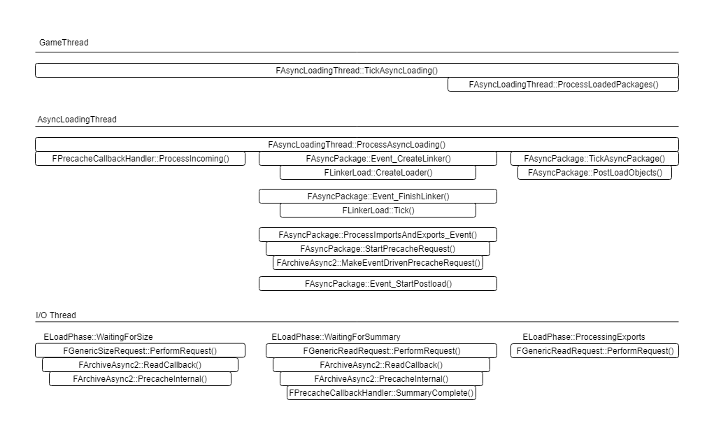

# 资源管理

## 接口介绍

同步加载资源
LoadObject
LoadClass
LoadPackage
FSoftObjectPath::TryLoad
FStreamableManager::RequestSyncLoad
FStreamableManager::LoadSynchronous
FlushAsyncLoading（异步转同步）
异步加载资源
LoadPackageAsync
FStreamableManager::RequestAsyncLoad
判断加载状态
IsGarbageCollectingOnGameThread 判断引擎当前是否在gc，如果当前帧处于gc中，这一帧就会跳过加载
IsLoading 判断引擎当前是否正在加载，包括同步异步的情况，内部就是判断全局变量GGameThreadLoadCounter是否大于0
GetNumAsyncPackages 返回当前正在加载的包
GetAsyncLoadPercentage 获取指定资源加载进度
FStreamableManager::IsAsyncLoadComplete 判断指定的FSoftObjectPath对应的资源是否已经加载完成

LoadObject，LoadClass，LoadPackage

这几个函数就是最常用的同步加载资源，内部会先调用FindObject在内存中找，找到了直接返回，没找到就会进入同步加载。如果看源码的话，会发现不管哪个同步加载函数，最终都会把路径转化为Package再进行LoadPackage。
最终调用的是LoadPackageAsync函数，这就是异步加载的入口，并且最后FlushAsyncLoading，内部阻塞等待，将异步加载转为同步。

``` c++
//UObjectGlobals.cpp
UPackage* LoadPackageInternal(UPackage* InOuter, const TCHAR* InLongPackageNameOrFilename, uint32 LoadFlags, FLinkerLoad* ImportLinker, FArchive* InReaderOverride, const FLinkerInstancingContext* InstancingContext)
{
    //...
    if (FCoreDelegates::OnSyncLoadPackage.IsBound())
    {
        FCoreDelegates::OnSyncLoadPackage.Broadcast(InName);
    }
    //异步加载接口
    int32 RequestID = LoadPackageAsync(InName, nullptr, *InPackageName);

    if (RequestID != INDEX_NONE)
    {
        //主线程阻塞等待
        FlushAsyncLoading(RequestID);
        {//FlushLoading
            while (IsAsyncLoadingPackages())
            {
                EAsyncPackageState::Type Result = TickAsyncLoadingFromGameThread(ThreadState, false, false, 0, RequestId);
                if (RequestId != INDEX_NONE && !ContainsRequestID(RequestId))
                    break;

                if (IsMultithreaded())
                {
                    FThreadHeartBeat::Get().HeartBeat();
                    FPlatformProcess::SleepNoStats(0.0001f);
                }
            }
        }
    }

    Result = (InOuter ? InOuter : FindObjectFast<UPackage>(nullptr, PackageFName));
    return Result;
}
```

所以异步同步到最后加载都是用的LoadPackageAsync。

## 资源加载实现

### 资源包文件的结构

Summary：这个是资源包的摘要信息，是加载资源时最早被加载进来的部分。里面最重要的就是保存有 __Import表和Export表__ ，Import表描述了这个资源依赖哪些资源，Export表描述了这个包里面有哪些资源，这些资源可以被外面其他资源依赖这样的信息。

Export1，Export2...：这个就是 __资源包内具体对象序列化后的二进制数据__ ，依次排列着，前面导出表里有多少个资源，这里就会有多少个资源。等所有的Export都加载完成，这个包就加载完成了。

### 资源加载流程概述

1.加载Summary，这一步有IO。
2.根据Import表信息，发起依赖资源的加载，并等待所有依赖资源完成。
在EDL加载过程中，开始时有多少个Import就会把计数设为多少，之后会把自己的回调函数挂到其他资源上，其他资源加载好了会回调回来把自己的计数减1，计数为0的时候就完成了整个Import步骤。
3.加载所有的Export对象并序列化，这一步有IO
4.执行PostLoad，并把对象加入引擎管理，完成加载

### 概念介绍

#### 1. 基础概念

了解加载过程前必须先了解UPackage、uasset文件格式、FLinkerLoad三个基本概念，一个资源在文件中对应uasset，在内存中对应为UPackage，而FLinkerLoad是作为uasset和内存UPackage的中间桥梁。

UPackage：
    一个资源在内存中表现为一个UPackage的实例，对于UPackage底下的UObject来说，UPackage是UObject的Outer。要知道资源自身数据UObject的内容，必须先知道UPackage才行。

uasset文件格式:
    File Summary 文件头信息
    Name Table 包中对象的名字表
    Import Table 存放被该包中对象引用的其它包中的对象信息(路径名和类型)
    Export Table 该包中的对象信息(路径名和类型)
    Export Objects 所有Export Table中对象的实际数据。
两个UPackage实例存在依赖关系，序列化到uasset文件的时候，这些依赖关系就存储为ImportTable。可以把ImportTable看做是这个资源所依赖的其他资源的列表，ExportTable就是这个资源本身的列表。 Export Objects 所有Export Table中对象的实际数据。

FLinkerLoad:
    在加载内容生成UPackage的时候，UPackage会根据名字找到uasset文件，由FLinkerLoad来负责加载。FLinkerLoad主要内容如下：

``` c++
    FArchive* Loader;//具体加载的loader
    TArray<FObjectImport> ImportMap;
    TArray<FObjectExport> ExportMap;
    TArray<TArray<FPackageIndex> > DependsMap;//自身exports所被依赖的pkg
```

//FObjectExport是这个UPackage所拥有的UObject(这些UObject都能提供给其他UPackage作为Import)

#### 2. EDL节点

``` c++
/** [EDL] Event Load Node */
enum class EEventLoadNode
{
    //加载Summary
    Package_LoadSummary,
    Package_SetupImports,
    Package_ExportsSerialized,
    Package_NumPhases,
    //等待Import对象
    ImportOrExport_Create = 0,
    ImportOrExport_Serialize,
    Import_NumPhases,
    //Export对象
    Export_StartIO = Import_NumPhases,
    Export_NumPhases,

    MAX_NumPhases = Package_NumPhases,
    Invalid_Value = -1
};
```

介绍一下优先级队列

``` c++
//EDL的优先级队列
struct FAsyncLoadEventQueue
{
    int32 RunningSerialNumber;
    //优先级队列
    TArray<FAsyncLoadEvent> EventQueue;

    FORCEINLINE void AddAsyncEvent(int32 UserPriority, int32 PackageSerialNumber, int32 EventSystemPriority, TFunction<void(FAsyncLoadEventArgs& Args)>&& Payload)
    {
        //构造FAsyncLoadEvent，加载请求入堆，维护大根堆，优先级大的先执行
        EventQueue.HeapPush(FAsyncLoadEvent(UserPriority, PackageSerialNumber, EventSystemPriority, ++RunningSerialNumber, Forward<TFunction<void(FAsyncLoadEventArgs& Args)>>(Payload)));
    }
    //出堆执行Payload
    bool PopAndExecute(FAsyncLoadEventArgs& Args)
    {
        FAsyncLoadEvent Event;
        ... ...
        EventQueue.HeapPop(Event, false);
        Event.Payload(Args);
    }
};

//EDL加载事件
//成员没有FAsyncPackage，具体的FAsyncPackage通过lambda的捕获列表传入
struct FAsyncLoadEvent
{
    //用于比较的优先级，依次比较
    int32 UserPriority;
    int32 EventSystemPriority;
    int32 PackageSerialNumber;
    int32 SerialNumber;
    //Event真正执行的函数
    TFunction<void(FAsyncLoadEventArgs& Args)> Payload;
}
```

### EventLoadGraph

``` c++
//这是EDL中所有请求节点的有向图
struct FEventLoadGraph
{
    TSet<FCheckedWeakAsyncPackagePtr> PackagesWithNodes;
    TArray<int32> IndicesToFire;

    FEventLoadNodeArray& GetArray(FEventLoadNodePtr& Node);

    FEventLoadNode& GetNode(FEventLoadNodePtr& NodeToGet);

    void AddNode(FEventLoadNodePtr& NewNode, bool bHoldForLater = false, int32 NumImplicitPrereqs = 0);
    void DoneAddingPrerequistesFireIfNone(FEventLoadNodePtr& NewNode, bool bWasHeldForLater = false);
    void AddArc(FEventLoadNodePtr& PrereqisiteNode, FEventLoadNodePtr& DependentNode);
    void RemoveNode(FEventLoadNodePtr& NodeToRemove);
    void NodeWillBeFiredExternally(FEventLoadNodePtr& NodeThatWasFired);
    void CheckForCycles(bool bDoSlowTests = (!UE_BUILD_SHIPPING && !UE_BUILD_TEST));
    bool CheckForCyclesInner(const TMultiMap<FEventLoadNodePtr, FEventLoadNodePtr>& Arcs, TSet<FEventLoadNodePtr>& Visited, TSet<FEventLoadNodePtr>& Stack, const FEventLoadNodePtr& Visit);
};

//每个要加载的资源上都存了一个数组，分两部分PackageNodes和Array
struct FEventLoadNodeArray
{
    //每个load节点（FEventLoadNode）都代表EEventLoadNode中的一步
    //加载summary的步骤是固定的，用静态数组来记
    FEventLoadNode PackageNodes[int(EEventLoadNode::Package_NumPhases)];
    //后面的步骤由import、export数来决定
    FEventLoadNode* Array;
    
    int32 TotalNumberOfImportExportNodes;
    int32 TotalNumberOfNodesAdded;
    int32 NumImports;
    int32 NumExports;
    int32 OffsetToImports;
    int32 OffsetToExports;
}

/** [EDL] Event Load Node Pointer */
struct FEventLoadNodePtr
{
    FCheckedWeakAsyncPackagePtr WaitingPackage;
    FPackageIndex ImportOrExportIndex;  // IsNull()==true for PACKAGE_ Phases
    EEventLoadNode Phase;
}

//通过PtrToNode得到
struct FEventLoadNode
{
    TArray<FEventLoadNodePtr> NodesWaitingForMe;//等待我的其他节点
    int32 NumPrerequistes;//自己依赖的剩余节点
    bool bFired;//自己执行完会fire，让其他节点开始执行
    bool bAddedToGraph;//正在执行时为true，全局的EventLoadGraph可以查到
};
```

### 加载流程源码分析



LoadPackage
添加加载请求到QueuedPackages : TArray<FAsyncPackageDesc*>

``` c++
int32 FAsyncLoadingThread::LoadPackage(const FString& InName, const FGuid* InGuid, const TCHAR* InPackageToLoadFrom, FLoadPackageAsyncDelegate InCompletionDelegate, EPackageFlags InPackageFlags, int32 InPIEInstanceID, int32 InPackagePriority, const FLinkerInstancingContext* InstancingContext)
{
    ... ...
    //广播给业务层
    if ( FCoreDelegates::OnAsyncLoadPackage.IsBound() )
    {
        FCoreDelegates::OnAsyncLoadPackage.Broadcast(InName);
    }
    //生成请求ID
    RequestID = IAsyncPackageLoader::GetNextRequestId();
    TRACE_LOADTIME_BEGIN_REQUEST(RequestID);
    AddPendingRequest(RequestID);
    //构造异步加载请求的描述
    FAsyncPackageDesc PackageDesc(RequestID, *PackageName, *PackageNameToLoad, InGuid ? *InGuid : FGuid(), MoveTemp(CompletionDelegatePtr), InPackageFlags, InPIEInstanceID, InPackagePriority);
    if (InstancingContext)
    {
        PackageDesc.SetInstancingContext(*InstancingContext);
    }
    //添加请求到加载队列
    QueuePackage(PackageDesc);
}

//加载请求入队
void FAsyncLoadingThread::QueuePackage(FAsyncPackageDesc& Package)
{
    QueuedPackagesCounter.Increment();
    QueuedPackages.Add(new FAsyncPackageDesc(Package, MoveTemp(Package.PackageLoadedDelegate)));

    NotifyAsyncLoadingStateHasMaybeChanged();

    QueuedRequestsEvent->Trigger();
}
```

tick执行加载请求

``` c++
EAsyncPackageState::Type FAsyncLoadingThread::TickAsyncThread(bool bUseTimeLimit, bool bUseFullTimeLimit, float TimeLimit, bool& bDidSomething, FFlushTree* FlushTree)
{
    if (!bShouldCancelLoading)
    {
        int32 ProcessedRequests = 0;
        double TickStartTime = FPlatformTime::Seconds();
        if (AsyncThreadReady.GetValue())
        {
            FGCScopeGuard GCGuard;
            //1.从QueuedPackages(Desc)中pop并生成Package，Push一个加载Event到EventQueue中
            CreateAsyncPackagesFromQueue(bUseTimeLimit, bUseFullTimeLimit, TimeLimit, FlushTree);
            if (IsGarbageCollectionWaiting() || (RemainingTimeLimit <= 0.0f && bUseTimeLimit && !IsMultithreaded()))
            {
                Result = EAsyncPackageState::TimeOut;
            }
            else
            {
                //2.继续
                FGCScopeGuard GCGuard;
                Result = ProcessAsyncLoading(ProcessedRequests, bUseTimeLimit, bUseFullTimeLimit, RemainingTimeLimit, FlushTree);
                bDidSomething = bDidSomething || ProcessedRequests > 0;
            }
        }
    }
}

//接1
int32 FAsyncLoadingThread::CreateAsyncPackagesFromQueue(bool bUseTimeLimit, bool bUseFullTimeLimit, float TimeLimit, FFlushTree* FlushTree)
{
    //计算每帧处理限制
    int32 TimeSliceGranularity = bUseTimeLimit ? MAX_int32 : 1; // do 4 packages at a time
    do
    {
        {
            FScopeLock QueueLock(&QueueCritical);
            //复制QueuedPackages，因为是两个线程，可以避免在加载过程中锁住
            QueueCopy.Reset();
            QueueCopy.Reserve(FMath::Min(TimeSliceGranularity, QueuedPackages.Num()));
            for (FAsyncPackageDesc* PackageRequest : QueuedPackages)
            {
                if (NumCopied < TimeSliceGranularity)
                {
                    NumCopied++;
                    QueueCopy.Add(PackageRequest);
                }
            }
        }

        //处理所有请求
        if (QueueCopy.Num() > 0)
        {
            for (FAsyncPackageDesc* PackageRequest : QueueCopy)
            {
                //用PackageDesc找是否有已存在的FAsyncPackage
                //1.1没有的话构造FAsyncPackage，通过InsertPackage开始加载
                ProcessAsyncPackageRequest(PackageRequest, nullptr, FlushTree);
                delete PackageRequest;
            }
        }
    }
}

//1.1
void FAsyncLoadingThread::ProcessAsyncPackageRequest(FAsyncPackageDesc* InRequest, FAsyncPackage* InRootPackage, FFlushTree* FlushTree)
{
    //查看1.是否已经在加载队列中，2.是否已加载，3.是否已加载待处理(主线程将异步线程加载完毕的package复制)
    FAsyncPackage* Package = FindExistingPackageAndAddCompletionCallback(InRequest, AsyncPackageNameLookup, FlushTree);
    if (!Package) Package = FindExistingPackageAndAddCompletionCallback(InRequest, LoadedPackagesNameLookup, FlushTree);
    if (!Package) Package = FindExistingPackageAndAddCompletionCallback(InRequest, LoadedPackagesToProcessNameLookup, FlushTree);
    //否则新建并
    if (!Package)
    {
        Package = new FAsyncPackage(*this, *InRequest, EDLBootNotificationManager);
        //回调从desc挪到AsyncPackage
        Package->AddCompletionCallback(MoveTemp(InRequest->PackageLoadedDelegate), false);
        //把自己和import依赖的package全都加进FlushTree->PackagesToFlush
        Package->PopulateFlushTree(FlushTree);
        //插入到等待列表
        InsertPackage(Package, false, EAsyncPackageInsertMode::InsertAfterMatchingPriorities);
        QueuedPackagesCounter.Decrement();
        NotifyAsyncLoadingStateHasMaybeChanged();
    }
}

//1.1，把QueueCopy中的FAsyncPackageDesc转为FAsyncPackage，CreateLinker开始正式加载流程
void FAsyncLoadingThread::InsertPackage(FAsyncPackage* Package, bool bReinsert, EAsyncPackageInsertMode InsertMode)
{
    //EDL
    if (GEventDrivenLoaderEnabled)
    {
        //通过权重排序插入到AsyncPackages，并添加到查找列表AsyncPackageNameLookup，表示完成预加载
        AsyncPackages.Add(Package);
        AsyncPackageNameLookup.Add(Package->GetPackageName(), Package);
        //1.1.1正式开始EDL流程，向FAsyncLoadingThread::EventQueue中加一个Event
        QueueEvent_CreateLinker(Package, FAsyncLoadEvent::EventSystemPriority_MAX);
        {//QueueEvent_CreateLinker()实现：
            //在静态的FAsyncPackage::GlobalEventGraph中添加
            Package->AddNode(EEventLoadNode::Package_LoadSummary);
            FWeakAsyncPackagePtr WeakPtr(Package);
            TAsyncLoadPriority UserPriority = Package->GetPriority();
            int32 PackageSerialNumber = GRandomizeLoadOrder ? GetRandomSerialNumber() : Package->SerialNumber;
            //EventQueue是FAsyncLoadEvent的优先级队列，构造并添加FAsyncLoadEvent，等执行到时调用下面函数
            EventQueue.AddAsyncEvent(UserPriority, PackageSerialNumber, EventSystemPriority,
            TFunction<void(FAsyncLoadEventArgs& Args)>(
                [WeakPtr, this](FAsyncLoadEventArgs& Args)
                {
                    FAsyncPackage* Pkg = GetPackage(WeakPtr);
                    if (Pkg)
                    {
                        Pkg->SetTimeLimit(Args, TEXT("Create Linker"));
                        Pkg->Event_CreateLinker();
                        Args.OutLastObjectWorkWasPerformedOn = Pkg->GetLinkerRoot();
                    }
                }
            ));
        }
    }
}

//1.1.1新建Package，读取summary
void FAsyncPackage::Event_CreateLinker()
{
    //...记录start time
    //在自己EventNodeArray中找到Package_LoadSummary这个EventNode，并把bFired标记为true
    NodeWillBeFiredExternally(EEventLoadNode::Package_LoadSummary);
    CreateLinker();//实现如下
    {
        //1.根据资源文件名创建一个空的UPackage，并添加引用防止被释放掉
        UPackage* Package = CreatePackage(*Desc.Name.ToString());
        AddObjectReference(Package);

        //2.创建linker
        Linker = FLinkerLoad::FindExistingLinkerForPackage(Package);
        if (!Linker)
        {
            if (GEventDrivenLoaderEnabled)
            {
                FWeakAsyncPackagePtr WeakPtr(this);
                FPrecacheCallbackHandler* PrecacheHandler = &AsyncLoadingThread.GetPrecacheHandler();
                //异步创建Linker，包括初始化Loader
                Linker = FLinkerLoad::CreateLinkerAsync(LoadContext, Package, *PackageFileName, LinkerFlags, Desc.GetInstancingContext()
                    , TFunction<void()>(
                        [WeakPtr, PrecacheHandler]()
                        {
                            //这里加载完了summary，会把该FWeakAsyncPackagePtr放到PrecacheHandler->IncomingSummaries中
                            //接下来通过ProcessIncoming处理
                            PrecacheHandler->SummaryComplete(WeakPtr);
                        }
                    ));
                if (Linker)
                {
                    AsyncLoadingThread.GetPrecacheHandler().RegisterNewSummaryRequest(this);
                    AsyncLoadingThread.GetPrecacheHandler().SummaryComplete(WeakPtr);
                }
            }
            else
            {
                Linker = FLinkerLoad::CreateLinkerAsync(LoadContext, Package, *PackageFileName, LinkerFlags, Desc.GetInstancingContext(), TFunction<void()>([]() {}));
            }
        }
    }
    check(AsyncPackageLoadingState == EAsyncPackageLoadingState::NewPackage);
    if (Linker)
    {
        AsyncPackageLoadingState = EAsyncPackageLoadingState::WaitingForSummary;
        Linker->bLockoutLegacyOperations = true;
    }
    else
    {
        RemoveNode(EEventLoadNode::Package_LoadSummary);
        EventDrivenLoadingComplete();
        AsyncPackageLoadingState = EAsyncPackageLoadingState::PostLoad_Etc;
        check(!AsyncLoadingThread.AsyncPackagesReadyForTick.Contains(this));
        AsyncLoadingThread.AsyncPackagesReadyForTick.Add(this);
    }
}

//2.继续处理异步加载
EAsyncPackageState::Type FAsyncLoadingThread::ProcessAsyncLoading(int32& OutPackagesProcessed, bool bUseTimeLimit /*= false*/, bool bUseFullTimeLimit /*= false*/, float TimeLimit /*= 0.0f*/, FFlushTree* FlushTree)
{
    if (GEventDrivenLoaderEnabled)
    {
        while (true)
        {
            //首先处理刚刚收集的已完成summary加载的FWeakAsyncPackagePtr，全部调用QueueEvent_FinishLinker，接下来进入FinishLinker的阶段
            bDidSomething = GetPrecacheHandler().ProcessIncoming();

            const float RemainingTimeLimit = FMath::Max(0.0f, TimeLimit - (float)(FPlatformTime::Seconds() - TickStartTime));
            int32 NumCreated = CreateAsyncPackagesFromQueue(bUseTimeLimit, bUseFullTimeLimit, RemainingTimeLimit);
            OutPackagesProcessed += NumCreated;
            bDidSomething = NumCreated > 0 || bDidSomething;
            //判断超时
            if (IsTimeLimitExceeded(TickStartTime, bUseTimeLimit, TimeLimit, TEXT("CreateAsyncPackagesFromQueue")))
            {
                return EAsyncPackageState::TimeOut;
            }

            //FAsyncLoadEvent的优先级队列中，出队并执行(PayLoad(Args))-
            if (EventQueue.PopAndExecute(Args))
            {
                OutPackagesProcessed++;
                if (IsTimeLimitExceeded(Args.TickStartTime, Args.bUseTimeLimit, Args.TimeLimit, Args.OutLastTypeOfWorkPerformed, Args.OutLastObjectWorkWasPerformedOn))
                {
                    return EAsyncPackageState::TimeOut;
                }
                bDidSomething = true;
            }
        }
        
    }
    else if(AsyncPackages.Num())//非EDL模式
    {
        //遍历
        for (int32 PackageIndex = 0; ((bDepthFirst && LoadingState == EAsyncPackageState::Complete) || (!bDepthFirst && LoadingState != EAsyncPackageState::TimeOut)) && PackageIndex < AsyncPackages.Num(); ++PackageIndex)
        {
            FAsyncPackage* Package = AsyncPackages[PackageIndex];
            if (FlushTree && !FlushTree->Contains(Package->GetPackageName()))
            {
                LoadingState = EAsyncPackageState::PendingImports;
            }
            else if (Package->HasFinishedLoading() == false)
            {
                if (GEventDrivenLoaderEnabled)
                {
                    LoadingState = EAsyncPackageState::PendingImports;
                }
                else
                {
                    //对每个AsyncPackage执行CreateLinker、FinishLinker、LoadImports、CreateImports、CreateExports、PreLoadObjects、CallCompletionCallbacks、PostLoadObjects等等
                    LoadingState = Package->TickAsyncPackage(bUseTimeLimit, bUseFullTimeLimit, TimeLimit, FlushTree);
                }
            }
        }
    }

}

```

阶段2：FinishLinker

``` c++
void FAsyncPackage::Event_FinishLinker()
{
    EAsyncPackageState::Type Result = EAsyncPackageState::Complete;
    if (Linker && !Linker->HasFinishedInitialization())
    {
        const float RemainingTimeLimit = TimeLimit - (float)(FPlatformTime::Seconds() - TickStartTime);
        //1.序列化资源summary信息
        FLinkerLoad::ELinkerStatus LinkerResult = Linker->Tick(RemainingTimeLimit, bUseTimeLimit, bUseFullTimeLimit, &ObjectNameWithOuterToExport);
    }
    return Result;
}

```

阶段3：LoadImports
功能：保证每个引用的Import
1.创建了TAsyncPackage，加入队列
2.执行到队列创建UPackage
3.创建FLinkerLoad并且已经FinishLinker
也就是说所有Imports都已经FinishLinker了

``` c++
EAsyncPackageState::Type FAsyncPackage::LoadImports(FFlushTree* FlushTree)
{
    // 遍历所有ImportMap并创建UPackage
    while (LoadImportIndex < Linker->ImportMap.Num() && !IsTimeLimitExceeded())
    {
        //取到名字
        FObjectImport* Import = &Linker->ImportMap[LoadImportIndex++];
        FName ImportPackageFName = Linker->GetInstancingContext().Remap(ImportToLoad);
        //先查查有没有创建UPackage
        UPackage* ExistingPackage = dynamic_cast<UPackage*>(StaticFindObjectFast(UPackage::StaticClass(), nullptr, ImportPackageFName, true));

        //已经全部创建，所有exports都已创建
        if (ExistingPackage && !ExistingPackage->bHasBeenFullyLoaded && !IsNativeCodePackage(ExistingPackage))
        {
            FLinkerLoad* PendingPackageLinker = PendingPackage->Linker;
            if (PendingPackageLinker == nullptr || !PendingPackageLinker->HasFinishedInitialization())
            {
                //linker的加载已经结束，添加到PendingImportedPackages.
                AddUniqueLinkerDependencyPackage(*PendingPackage, FlushTree);
            }
            else
            {
                //添加引用
                PendingPackage->DependencyRefCount.Increment();
                ReferencedImports.Add(PendingPackage);
                //递归，把
                TSet<FAsyncPackage*> SearchedPackages;
                AddDependencyTree(*PendingPackage, SearchedPackages, FlushTree);
            }
        }

        //没创建并且不在PendingImportedPackages数组中
        if (!ExistingPackage && ContainsDependencyPackage(PendingImportedPackages, ImportPackageFName) == INDEX_NONE)
        {
            const FString ImportPackageName(ImportPackageFName.ToString());
            //创建FAsyncPackage插入到队列中（AsyncLoadingThread.InsertPackage）
            AddImportDependency(ImportPackageFName, ImportToLoad, FlushTree, InstancingContext);
        }
    }
}

void FAsyncPackage::AddImportDependency(const FName& PendingImport, const FName& PackageToLoad, FFlushTree* FlushTree, FLinkerInstancingContext InstancingContext)
{
    FAsyncPackage* PackageToStream = AsyncLoadingThread.FindAsyncPackage(PendingImport);
    const bool bReinsert = PackageToStream != nullptr;
    //如果PendingImport没有对应FAsyncPackage用于加载，创建并且插入到加载队列
    if (!PackageToStream)
    {
        FAsyncPackageDesc Info(INDEX_NONE, PendingImport, PackageToLoad);
        Info.SetInstancingContext(MoveTemp(InstancingContext));
        PackageToStream = new FAsyncPackage(AsyncLoadingThread, Info, EDLBootNotificationManager);
        //创建FAsyncPackage插入到队列中
        AsyncLoadingThread.InsertPackage(PackageToStream, bReinsert);
    }

    //如果还没加载完，放入到PendingImportedPackages中
    if (!PackageToStream->HasFinishedLoading() && !PackageToStream->bLoadHasFailed)
    {
        const bool bInternalCallback = true;
        TUniquePtr<FLoadPackageAsyncDelegate> InternalDelegate = MakeUnique<FLoadPackageAsyncDelegate>(FLoadPackageAsyncDelegate::CreateRaw(this, &FAsyncPackage::ImportFullyLoadedCallback));
        PackageToStream->AddCompletionCallback(MoveTemp(InternalDelegate), bInternalCallback);
        PackageToStream->DependencyRefCount.Increment();
        PendingImportedPackages.Add(PackageToStream);
        //递归，把import下依赖的PendingImportedPackages都放到FlushTree
        if (FlushTree) PackageToStream->PopulateFlushTree(FlushTree);
    }
    else
    {
        //ReferencedImports：已经加载好的引用的Imports
        PackageToStream->DependencyRefCount.Increment();
        ReferencedImports.Add(PackageToStream);
    }
}
```

阶段4：CreateImports
给fimport

接下来具体介绍UPackage的结构以及通过FLinkerLoad加载的具体流程。
资源在文件夹中对应uasset，在内存中对应为UPackage。
UPackage序列化到本地之后就是uasset文件，uasset是本地的资源文件。包括如下：

两个UPackage实例存在依赖关系，序列化到uasset文件的时候，这些依赖关系就存储为ImportTable。可以把ImportTable看做是这个资源所依赖的其他资源的列表，ExportTable就是这个资源本身的列表。 Export Objects 所有Export Table中对象的实际数据。
