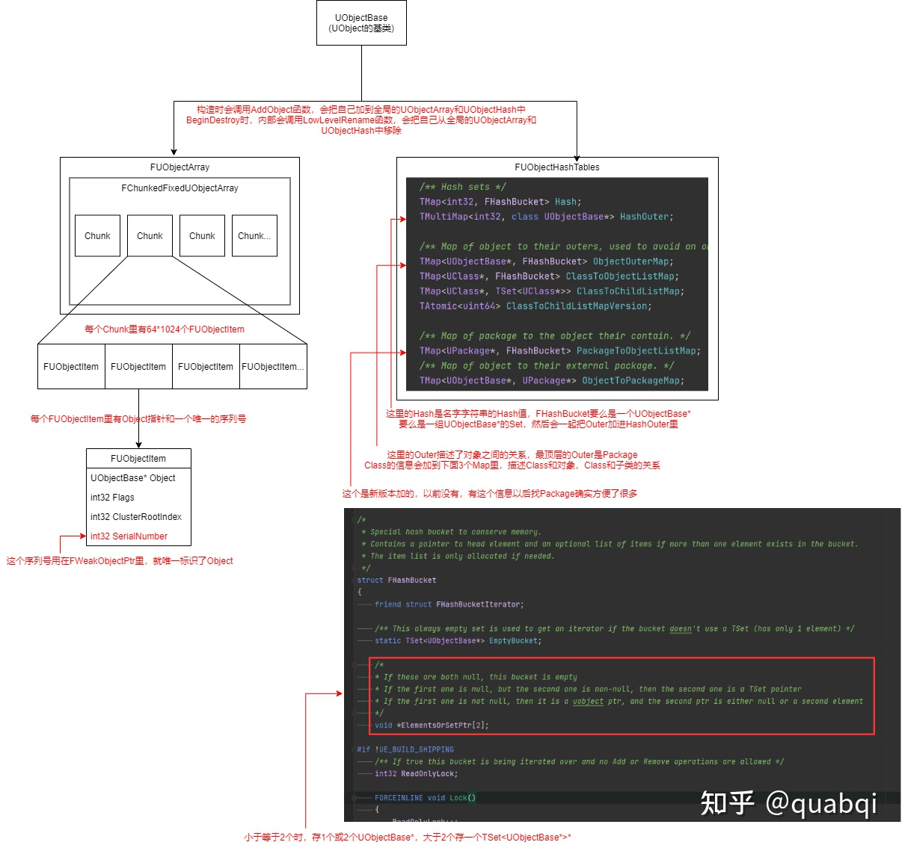

# 智能指针

## UObject的管理方式

UObject由UObjectArray和UObjectHash两个容器进行维护


### UObjectArray

全局的UObjectArray是管理所有的UObject信息的大数组，有chunk下面一个个FUObjectItem来保存。
通过UObjectBase的InternalIndex作为下标可以找到UObjectArray中对应的FUObjectItem。
有可能这个位置的UObject被释放，然后这里有分配给新的UObject。此时SerialNumber（序列号）就会自增，业务就有办法区分这个UObjectItem指向的是不是还是刚才的UObject。

``` c++
//UObjectArray中的元素
struct FUObjectItem
{
    // Pointer to the allocated object
    class UObjectBase* Object;
    // Internal flags
    int32 Flags;
    // UObject Owner Cluster Index
    int32 ClusterRootIndex;    
    // Weak Object Pointer Serial number associated with the object
    int32 SerialNumber;
}
```

### FWeakObjectPtr

FWeakObjectPtr通过保存ObjectIndex和ObjectSerialNumber来保证找到指向的UObject。

``` c++
struct FWeakObjectPtr
{
    int32 ObjectIndex;
    int32 ObjectSerialNumber;
    //赋值就是通过GUObjectArray获取ObjectIndex和ObjectSerialNumber
    void FWeakObjectPtr::operator=(const class UObject *Object)
    {
        if (Object)
        {
            //Object->InternalIndex
            ObjectIndex = GUObjectArray.ObjectToIndex((UObjectBase*)Object);
            ObjectSerialNumber = GUObjectArray.AllocateSerialNumber(ObjectIndex);
        }
    }
    //获取也是通过ObjectIndex和SerialNumber获取
    UObject* Internal_Get(bool bEvenIfPendingKill) const
    {
        UObject* Result = nullptr;
        //通过SerialNumbersMatch检查SerialNumber是否相等
        if (Internal_IsValid(true, true))
        {
            //通过ObjectIndex找ObjectItem
            FUObjectItem* ObjectItem = GUObjectArray.IndexToValidObject(GetObjectIndex(), bEvenIfPendingKill);
            if (ObjectItem)
            {
                Result = (UObject*)ObjectItem->Object;
            }
        }
        return Result;
    }
}
```

### TStrongObjectPtr
